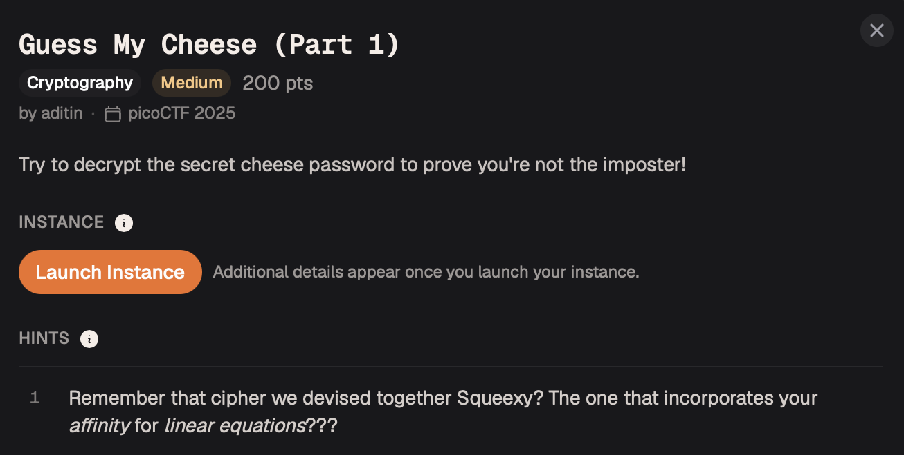

# Guess My Cheese (Part 1) — Cryptography

**Platform:** picoCTF 2025  
**Category:** Cryptography  
**Difficulty:** Easy  
**Flag:** `picoCTF{CHEESEISTHEBEST}`

---

## TL;DR

The ciphertext is produced by an **affine cipher** — a classical substitution cipher of the form `C = (a·P + b) mod 26`. Given one plaintext–ciphertext pair (`CHEDDAR` → `MHKLLOX`), a brute-force search over all valid `(a, b)` pairs recovers the key and decrypts the target ciphertext.

---

## Background: the Affine Cipher

The affine cipher encrypts each plaintext letter `P` (0–25) as:

```
C = (a · P + b) mod 26
```

where `a` and `b` are the key parameters. For the cipher to be invertible, `a` must be **coprime with 26** — i.e., `gcd(a, 26) = 1`. There are exactly 12 valid values of `a`: `{1, 3, 5, 7, 9, 11, 15, 17, 19, 21, 23, 25}`, and 26 values of `b`, giving 312 possible keys — small enough to brute-force exhaustively.

Decryption uses the modular inverse of `a`:

```
P = a⁻¹ · (C − b) mod 26
```

---

## Given Information

| Role | Value |
|------|-------|
| Known plaintext | `CHEDDAR` |
| Known ciphertext | `MHKLLOX` |
| Target ciphertext | `JABVOGBKNDKOUKDS` |

---

## Step 1 — Find the key by brute force

Iterate over all `(a, b)` pairs where `gcd(a, 26) = 1`. For each pair, check whether `(a · P + b) mod 26 == C` holds for **every** letter of the known plaintext–ciphertext pair. The pair that satisfies all seven letter mappings simultaneously is the key.



---

## Step 2 — Decrypt the target

With the correct `(a, b)` identified, compute the modular inverse `a⁻¹ mod 26` and apply the decryption formula to each letter of `JABVOGBKNDKOUKDS`.

---

## Solve Script

```python
from math import gcd

plain  = "CHEDDAR"
cipher = "MHKLLOX"
target = "JABVOGBKNDKOUKDS"

for a in [x for x in range(1, 26) if gcd(x, 26) == 1]:
    for b in range(26):
        # Check if (a, b) is consistent with all plaintext-ciphertext pairs
        ok = all(
            (a * (ord(p) - ord('A')) + b) % 26 == ord(c) - ord('A')
            for p, c in zip(plain, cipher)
        )
        if ok:
            a_inv = pow(a, -1, 26)    # Python 3.8+ built-in modular inverse
            result = ''.join(
                chr((a_inv * (ord(ch) - ord('A') - b)) % 26 + ord('A'))
                for ch in target
            )
            print(f"a={a}, b={b}  →  {result}")
```

Output:

```
a=7, b=6  →  CHEESEISTHEBEST
```

**Flag:** `picoCTF{CHEESEISTHEBEST}`

---

## Key Takeaways

- The affine cipher has a **tiny key space** (312 keys). Even a single known plaintext–ciphertext pair of reasonable length fully determines the key.
- `pow(a, -1, 26)` in Python 3.8+ computes the modular inverse directly — no extended Euclidean algorithm needed.
- Classical substitution ciphers provide no security against any adversary who can make even one pair of observations. They appear in CTFs primarily to test familiarity with modular arithmetic.
