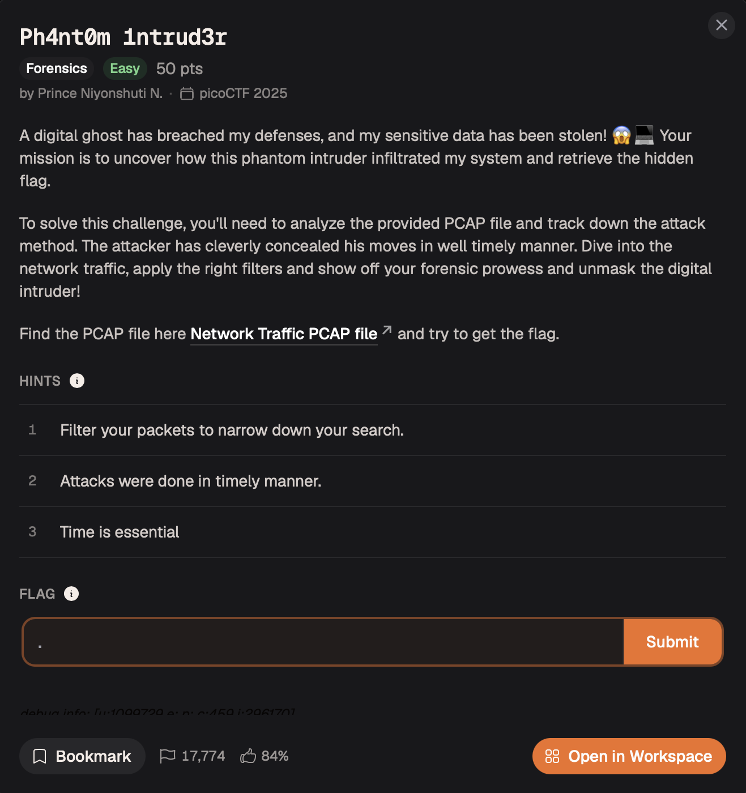
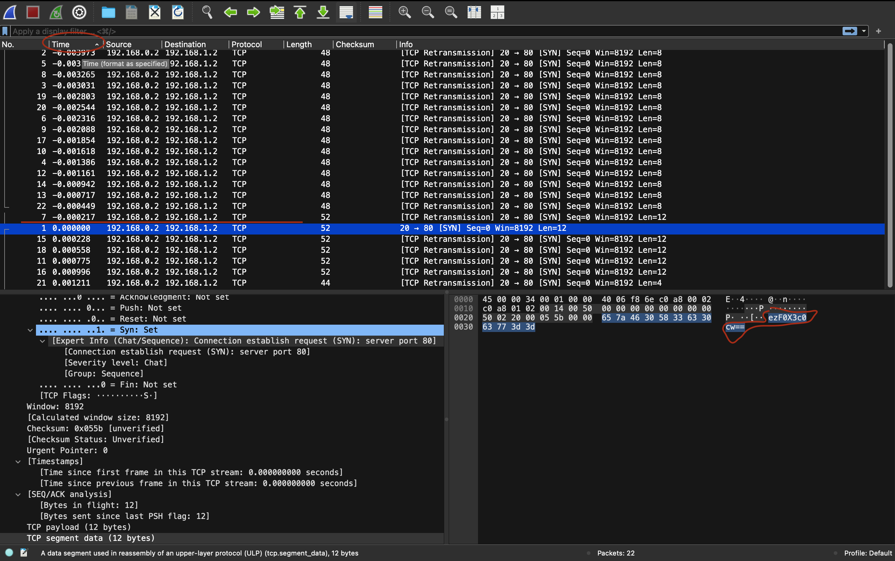
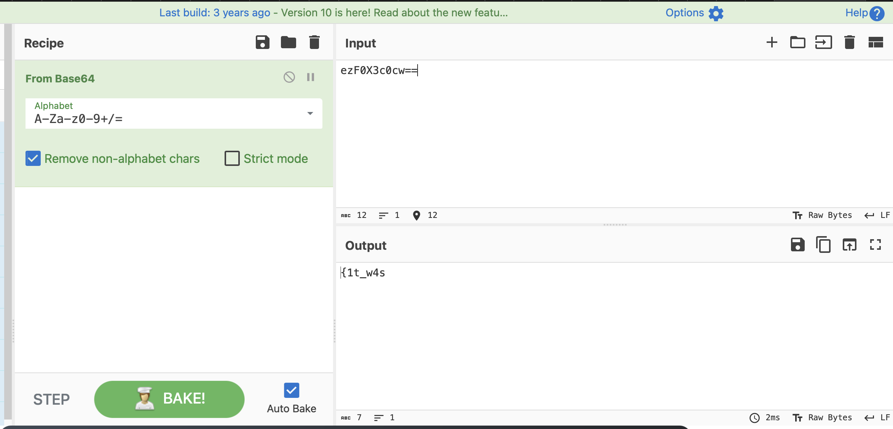
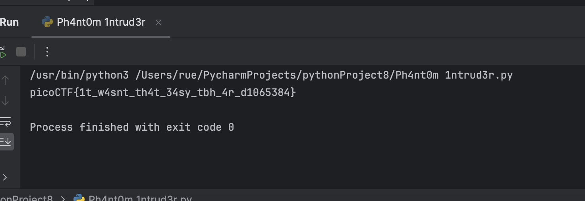

# Ph4nt0m 1ntrud3r — Forensics

**Platform:** picoCTF 2025  
**Category:** Forensics  
**Difficulty:** Easy  
**Points:** 50  
**Flag:** `picoCTF{1t_w4snt_th4t_34sy_tbh_4r_d1065384}`

---

## TL;DR

A PCAP containing 22 TCP SYN packets, each carrying a Base64-encoded payload. The packets are deliberately shuffled in the capture file. Sorting them by their **exact send timestamp** (not file order) and concatenating only the payloads that decode to printable ASCII recovers the flag.

---

## Given Hints

1. *"Filter your packets to narrow down your search."*
2. *"Attacks were done in timely manner."*
3. *"Time is essential."*

All three hints converge on the same answer: the key is **time** — specifically, the exact timestamp of each packet.

---

## Step 1 — Open the capture and survey the traffic

Open `myNetworkTraffic.pcap` in Wireshark. You'll see **22 TCP SYN packets** from `192.168.0.2` (source port `ftp-data` / 20) to `192.168.1.2` (destination port `http` / 80).



The port numbers (`ftp-data → http`) are a red herring — there is no real FTP or HTTP session. Each packet carries a short raw payload, visible in the hex/ASCII pane:

```
ezF0X3c0cw==
I+znCJg=
cGljb0NURg==
...
```

These look like Base64 strings (trailing `=`/`==` padding). Decoding a few individually shows that **some** produce clean ASCII text while **others** produce binary garbage. Those are the real flag fragments vs. decoy noise.

---

## Step 2 — Sort by exact timestamp

The packets are **shuffled** inside the PCAP file — reading them top-to-bottom in "No." order produces fragments in the wrong sequence. Hints 2 and 3 tell you to sort by **time**.

In Wireshark:
1. Click the **Time** column header to sort ascending.
2. Increase precision to avoid rounding: **View → Time Display Format → Seconds since Beginning of Capture** with 6+ decimal places. (The gaps between packets are sub-millisecond — around 0.0002 s — so default 3-decimal display can make several packets look simultaneous.)



---

## Step 3 — Decode each payload in time order

**Important:** do **not** concatenate the Base64 strings before decoding. The `=`/`==` padding characters are only valid at the very end of a complete Base64 string; concatenating padded chunks produces invalid Base64 mid-string.

In CyberChef (`https://gchq.github.io/CyberChef/`):
1. Paste all 22 Base64 strings, **one per line**, in the time-sorted order from Wireshark.
2. Add **Fork** (split delimiter: `\n`) — processes each line independently.
3. Add **From Base64** — decodes each chunk on its own.



Clean readable fragments appear in time order; binary-garbage lines are the decoys. Read off only the clean ones and concatenate:

```
picoCTF  +  {1t_w4s  +  nt_th4t  +  _34sy_t  +  bh_4r_d  +  1065384  +  }
```

---

## Automated Solve (Python / Scapy)

```python
from scapy.all import *
import base64

pkts = rdpcap('myNetworkTraffic.pcap')

# Pair each packet's exact float timestamp with its raw payload
data = [
    (float(p.time), bytes(p[Raw].load))
    for p in pkts
    if p.haslayer(Raw)
]

# Sort by timestamp — recovers the true send order
data.sort()

flag = b''
for t, raw in data:
    dec = base64.b64decode(raw)
    # Real flag fragments decode to printable ASCII; decoys decode to binary junk
    if all(32 <= c < 127 for c in dec):
        flag += dec

print(flag.decode())
# picoCTF{1t_w4snt_th4t_34sy_tbh_4r_d1065384}
```

`p.time` gives microsecond-precision timestamps — far more reliable than eyeballing Wireshark columns. The `all(32 <= c < 127 ...)` filter cleanly separates real fragments (printable ASCII) from decoy noise (random bytes).



---

## Why This Works

- Every payload is valid Base64 (both real and decoy), so `b64decode()` never throws.
- Real flag chunks decode to plain ASCII bytes (all in range 32–126).
- Decoy chunks decode to essentially random bytes, most of which fall outside the printable range.
- Sorting by timestamp exactly reverses the shuffling the challenge author applied inside the PCAP.

---

## Key Takeaway

This challenge demonstrates a **covert timing channel**: the message is not hidden in packet content or headers, but in the **relative order** packets were originally sent — an order that must be recovered from timestamps rather than assumed from file or display sequence.
