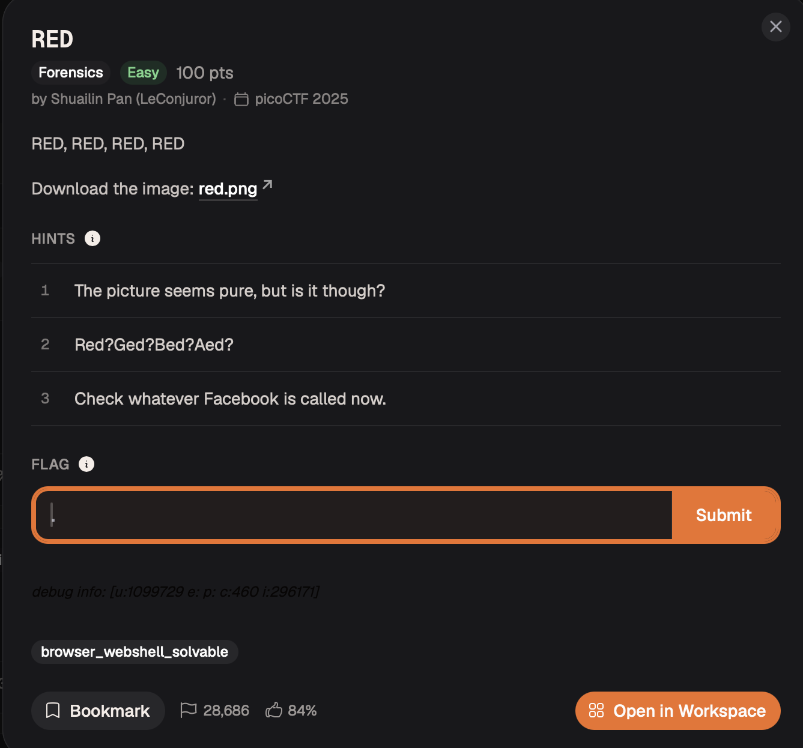
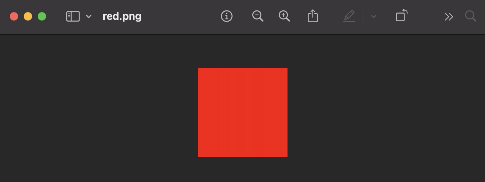
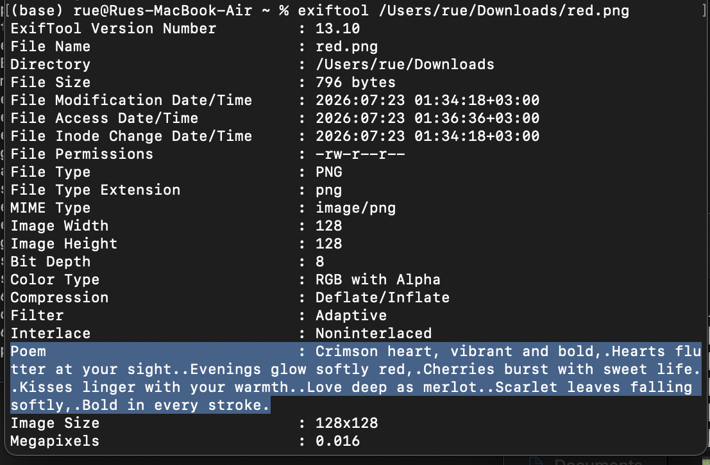

# RED — Forensics / Steganography

**Platform:** picoCTF 2025  
**Category:** Forensics / Steganography  
**Difficulty:** Medium  
**Flag:** `picoCTF{r3d_1s_th3_ult1m4t3_cur3_f0r_54dn355_}`

---

## TL;DR

A 128×128 PNG that looks like a solid red square. Two layers of hidden data: (A) a custom tEXt metadata chunk containing a poem whose first letters spell **CHECK LSB**; (B) 1-bit-per-channel LSB steganography across all four RGBA channels, producing a Base64 string that decodes to the flag.

---

## Given Hints

1. *"The picture seems pure, but is it though?"*
2. *"Red? Ged? Bed? Aed?"*
3. *"Check whatever Facebook is called now."*

Decoding the hints:
- Hint 3 → "Facebook is now called **Meta**" → check the image **metadata**.
- Hint 2 → swapping the first letter of "Red": R→G→B→A → the four **RGBA** colour channels.
- Hint 1 → the image is not truly uniform; something is hidden.

---

## Part A — Metadata: the acrostic poem

```bash
exiftool red.png
```

Among standard fields (dimensions, bit depth, colour type), `exiftool` reveals a custom PNG tEXt chunk:

```
Poem : Crimson heart, vibrant and bold,
       Hearts flutter at your sight.
       Evenings glow softly red,
       Cherries burst with sweet life.
       Kisses linger with your warmth.
       Love deep as merlot.
       Scarlet leaves falling softly,
       Bold in every stroke.
```



Read the **first letter of each line**:

```
C · H · E · C · K · L · S · B
```

→ **CHECK LSB**

This is an acrostic cipher embedded in the poem, telling us exactly where to look next: the **Least Significant Bit** of the pixel data.

---

## Part B — LSB steganography across RGBA channels

### What is LSB steganography?

Each colour channel value (0–255) is stored as one byte. Changing the lowest bit (LSB) shifts the value by at most ±1 — a difference imperceptible to the human eye. By encoding one bit of a hidden message into the LSB of each channel of each pixel, an attacker can smuggle an arbitrary bitstream through an image that still looks "pure" to visual inspection.

### Inspecting the pixel values

Loading the image in Python/PIL reveals:

| Channel | Observed values |
|---------|----------------|
| Red | 254 or 255 |
| Green | 0 or 1 |
| Blue | 0 or 1 |
| Alpha | 254 or 255 |

Every channel only varies by 1 — the hidden bitstream.

Additionally, the entire 128×128 image consists of the **same row repeated 128 times**. Only the first row (128 pixels × 4 channels = 512 bits = 64 bytes) is needed.

### Extracting the hidden data

Reading bits from each pixel in channel order **R → G → B → A** and packing them MSB-first into bytes produces a valid Base64 string. Every other channel permutation produces garbage.

**CyberChef method:**
1. Drop `red.png` into the Input pane.
2. Add **Extract LSB** → select channels: Red, Green, Blue, Alpha.
3. Add **From Base64**.



The output is the flag.

---

## Solve Script

```python
from PIL import Image
import numpy as np
import base64

# Load as RGBA — forces all 4 channels even if the file stores fewer
im = Image.open('red.png').convert('RGBA')

# The image repeats every row; only the first row is needed
row = np.array(im)[0]   # shape: (128, 4)

bits = []
for i in range(128):            # 128 pixels
    for ch in (0, 1, 2, 3):     # R, G, B, A
        bits.append(row[i][ch] & 1)   # extract the LSB

# Pack bits into bytes, MSB first
byte_arr = bytearray()
for j in range(0, len(bits) - 7, 8):
    val = 0
    for bit in bits[j:j+8]:
        val = (val << 1) | bit
    byte_arr.append(val)

b64_string = byte_arr.decode('ascii')
print("Base64:", b64_string)

flag = base64.b64decode(b64_string).decode('utf-8')
print("Flag:  ", flag)
```

```
Base64: cGljb0NURntyM2RfMXNfdGgzX3VsdDFtNHQzX2N1cjNfZjByXzU0ZG4zNTVffQ==
Flag:   picoCTF{r3d_1s_th3_ult1m4t3_cur3_f0r_54dn355_}
```



---

## How the Channel Order Was Determined

If the correct channel order is unknown, brute-force all 24 permutations of {R, G, B, A}, decode each resulting bitstream as ASCII, and score by fraction of printable bytes. The correct permutation (R→G→B→A) gives 100% printable ASCII and valid Base64 — every other permutation produces mostly non-printable bytes.

---

## Key Takeaways

- A visually "solid-colour" or "boring" image is the first reason to suspect steganography, not a reason to dismiss it.
- **Always run `exiftool`** on challenge images — PNG tEXt chunks can carry arbitrary metadata that is invisible in a normal viewer.
- LSB steganography across all four RGBA channels provides ~0.5 bits of hidden data per pixel with no visible quality degradation.
- The correct channel read order is part of the key; when unknown, all 24 permutations are cheap to try.
