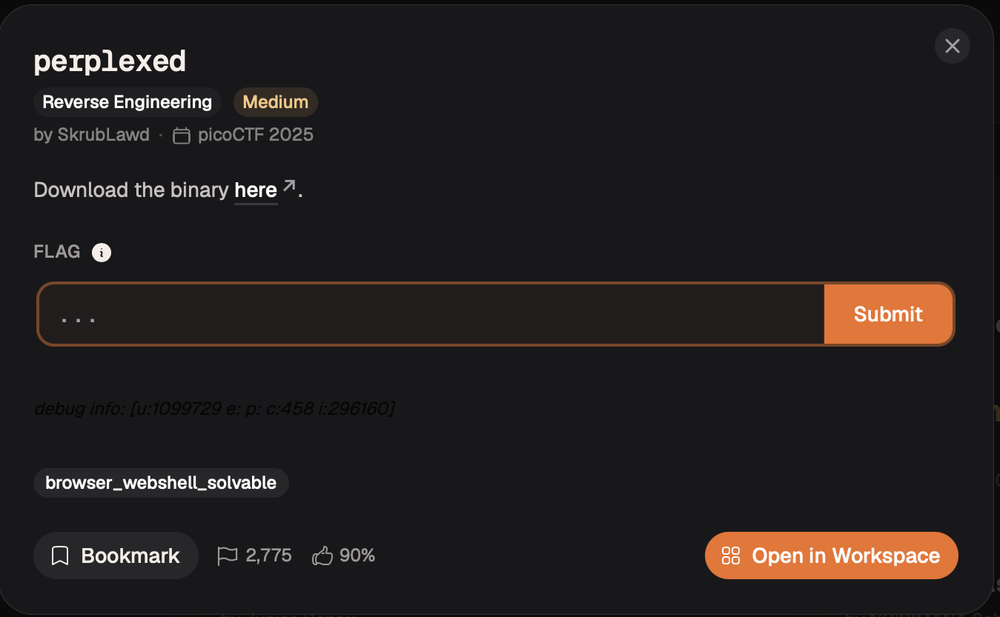
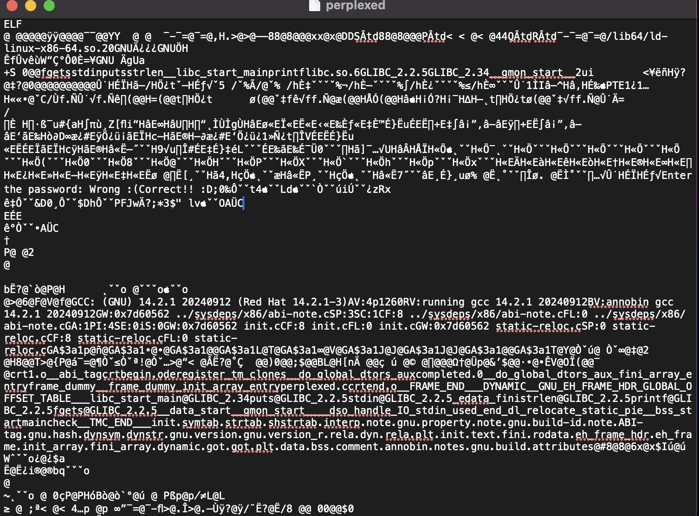

# perplexed — Reverse Engineering

**Platform:** picoCTF 2025  
**Category:** Reverse Engineering  
**Difficulty:** Medium  
**Binary:** `perplexed` — ELF 64-bit, x86-64, dynamically linked, **not stripped**  
**Flag:** `picoCTF{0n3_bi7_4t_a_7im3}`

---

## TL;DR

A password-checking crackme. `check()` requires exactly 27 input bytes, then compares individual **bits** of the input against a 23-byte reference array embedded in the code via `movabs` constants. The bit-indexing follows a fixed state machine that is completely independent of the actual input — simulate it in Python to map every reference bit to its target (input byte, bit position), then reconstruct the password directly without brute force.

---

## Step 1 — Initial recon

```bash
file perplexed
# perplexed: ELF 64-bit LSB executable, x86-64, dynamically linked, not stripped

chmod +x perplexed
echo "" | timeout 3 ./perplexed
# Enter the password: Wrong :(
```

`strings -n 6 perplexed` shows `"Enter the password:"`, `"Wrong :("`, `"Correct!! :D"` — but **no literal password or flag string**. The check is computed, not a simple `strcmp`. Time to disassemble.

---

## Step 2 — Locate the relevant functions

The binary is **not stripped** — real function names survive in the symbol table. This is the single biggest time-saver; no need to hunt for `main` by hand.

```bash
objdump -d -M intel perplexed --disassemble=main
objdump -d -M intel perplexed --disassemble=check
```

`main()` boils down to:

```
fgets(buf, 0x100, stdin)
if (check(buf) == 1)  →  puts("Correct!! :D")
else                  →  puts("Wrong :(")
```



---

## Step 3 — Reading `check()`

**Length check** (first guard in `check`):

```asm
call strlen
cmp  rax, 0x1b      ; 0x1b = 27
je   <continue>
mov  eax, 1         ; return FAIL immediately if length ≠ 27
```

Password must be **exactly 27 bytes long** (including the `\n` that `fgets` captures).

**Reference array** embedded via `movabs`:

```asm
movabs rax, 0x617b2375f81ea7e1   ; stored at [rsp+0x00]
movabs rdx, 0xd269df5b5afc9db9   ; stored at [rsp+0x08]
movabs rax, 0xf467edf4ed1bfed2   ; stored at [rsp+0x0f]  ← overlaps by 1 byte
```

Reassembling in little-endian order gives a **23-byte reference array**:

```
e1 a7 1e f8 75 23 7b 61   (bytes 0–7,  from first movabs)
b9 9d fc 5a 5b df 69 d2   (bytes 8–15, from second movabs)
fe 1b ed f4 ed 67 f4      (bytes 15–22, from third movabs — note overlap at byte 15)
```

**Bit-level comparison loop:**

```asm
shl  edx, cl          ; mask1 = 1 << (7 - j)   — selects bit j of ref[block]
and  eax, edx
setg cl               ; cl = 1 if that bit is set

shl  edx, cl          ; mask2 = 1 << (7 - k)   — selects bit k of input[idx]
and  eax, edx
...
```

This is **bit-level** comparison, not byte-level. One bit of a reference-array byte is compared against one bit of an input byte, and the two bit positions drift independently across three interacting counters (`block`, `j`, `k`, `idx`).

---

## Step 4 — Emulate the state machine

Instead of tracing three nested counters by hand (a great way to introduce off-by-one errors), the control flow was ported directly into Python and run **without any real input** — just to record the static mapping from each reference bit to its target (input byte index, input bit position):

```python
ref = bytes.fromhex("e1a71ef875237b61b99dfc5a5bdf69d2fe1bedf4ed67f4")

idx, k = 0, 0
bits_needed = {}   # {input_byte_index: {bit_position: required_value}}

for block in range(0x17):        # 23 ref bytes
    for j in range(8):           # 8 bits per byte
        if k == 0:
            k += 1               # quirk: bit 7 (MSB) of every input byte is never checked
        ref_bit = (ref[block] >> (7 - j)) & 1
        bits_needed.setdefault(idx, {})[7 - k] = ref_bit
        k += 1
        if k == 8:
            k = 0
            idx += 1

password = bytearray(27)
for i, bits in bits_needed.items():
    for bitpos, val in bits.items():
        if val:
            password[i] |= (1 << bitpos)

print(bytes(password))
```

Two observations fall out for free:

1. The `if k == 0: k += 1` skip means **bit 7 (the MSB) of every input byte is never constrained**. For printable ASCII this is irrelevant (the flag is plain ASCII, MSB always 0).
2. Only **26 bytes** are fully constrained. The 27th has only 2 bits checked — because `fgets()` includes the trailing `\n` (0x0A), and `\n` happens to satisfy those two loose bits. You don't type a 27th character; pressing Enter provides it automatically.

---

## Step 5 — Result and verification

```
b'picoCTF{0n3_bi7_4t_a_7im3}\n'
```

```bash
echo "picoCTF{0n3_bi7_4t_a_7im3}" | ./perplexed
# Enter the password: Correct!! :D
```



---

## Full Solve Script

```python
import struct

# Three 64-bit little-endian constants from movabs instructions
v1 = 0x617b2375f81ea7e1
v2 = 0xd269df5b5afc9db9
v3 = 0xf467edf4ed1bfed2

b1, b2, b3 = (struct.pack('<Q', v) for v in (v1, v2, v3))
buf = bytearray(23)
buf[0:8]   = b1
buf[8:16]  = b2
buf[15:23] = b3        # third movabs overlaps at offset 15
ref = bytes(buf)

idx, k = 0, 0
bits_needed = {}

for block in range(0x17):
    for j in range(8):
        if k == 0:
            k += 1
        ref_bit = (ref[block] >> (7 - j)) & 1
        bits_needed.setdefault(idx, {})[7 - k] = ref_bit
        k += 1
        if k == 8:
            k = 0
            idx += 1

password = bytearray(27)
for i, bits in bits_needed.items():
    for bitpos, val in bits.items():
        if val:
            password[i] |= (1 << bitpos)

print(bytes(password))
```

---

## Key Takeaways

- **Check `file` and `checksec` first.** "Not stripped" means real symbol names survive — saves significant time compared to hunting for `main` in a stripped binary.
- **Custom bit-shuffled comparisons look scary in raw disassembly, but the control flow (which bit maps to which) is data-independent.** Simulate the bookkeeping separately, treating it as a mapping problem rather than trying to hold three nested counters in your head.
- **`fgets()` keeps the trailing newline.** Off-by-one length checks in crackmes are frequently explained by this; always account for the `\n` when the binary uses `fgets`.
- **No brute force was needed.** The comparison order is fully fixed by the code, making the entire password recoverable analytically in O(n) time.
