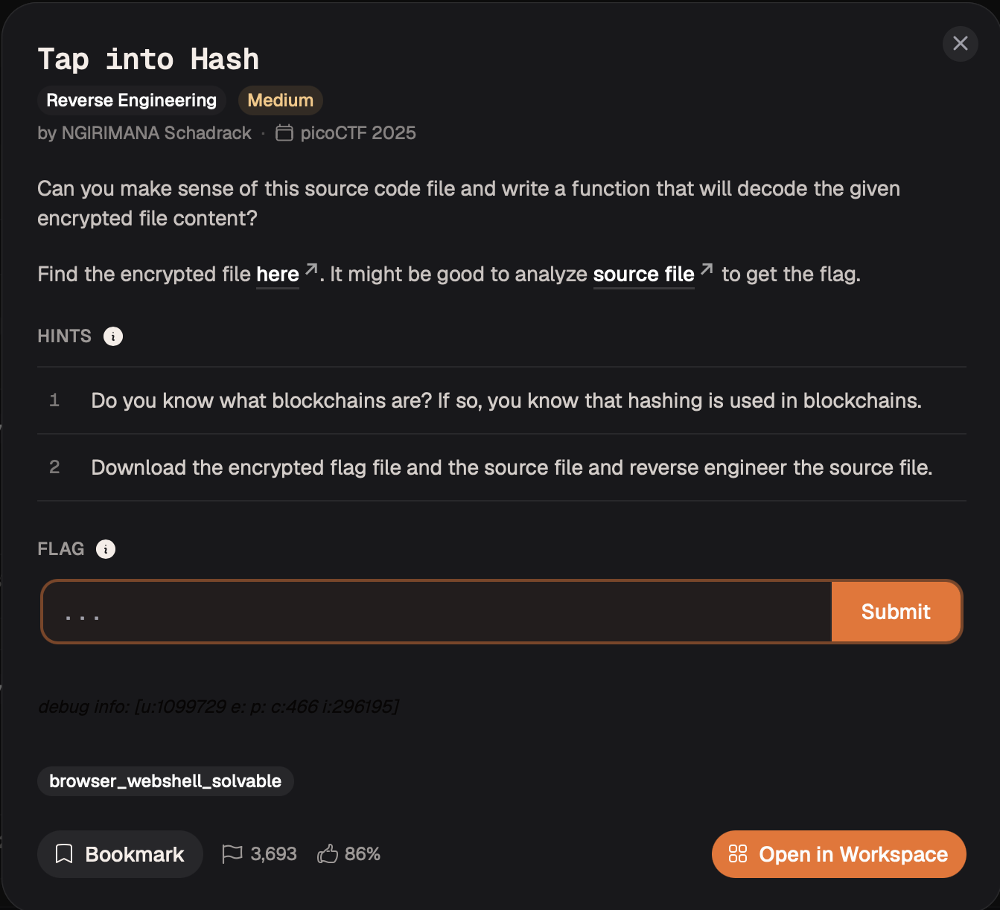
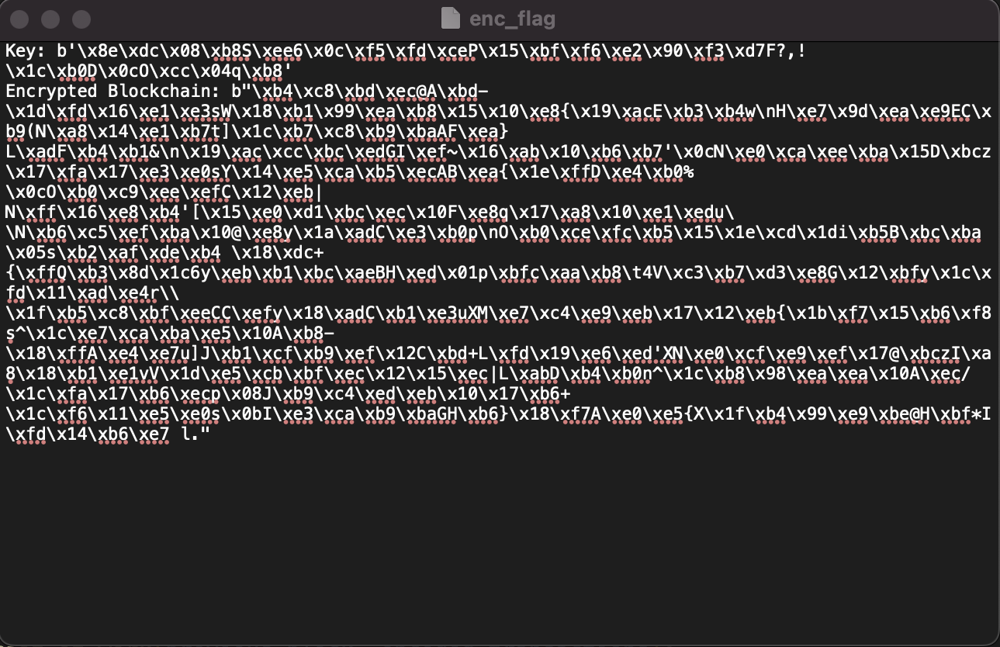
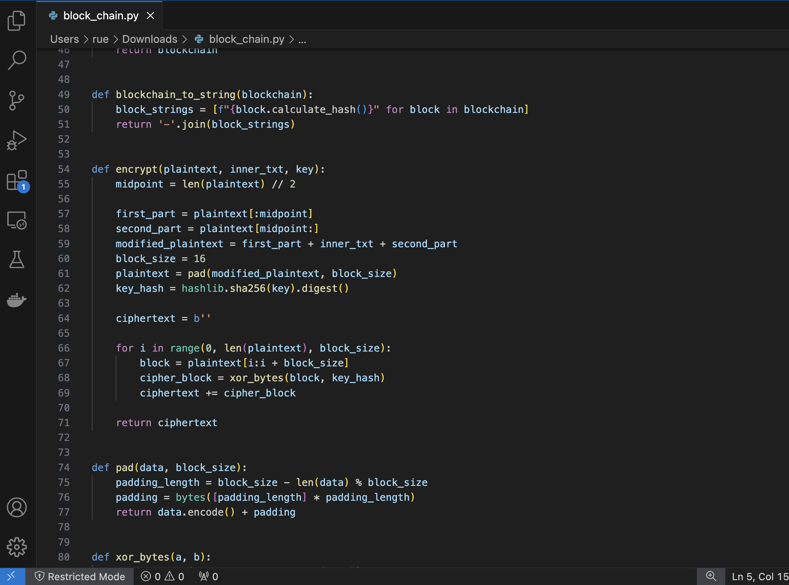
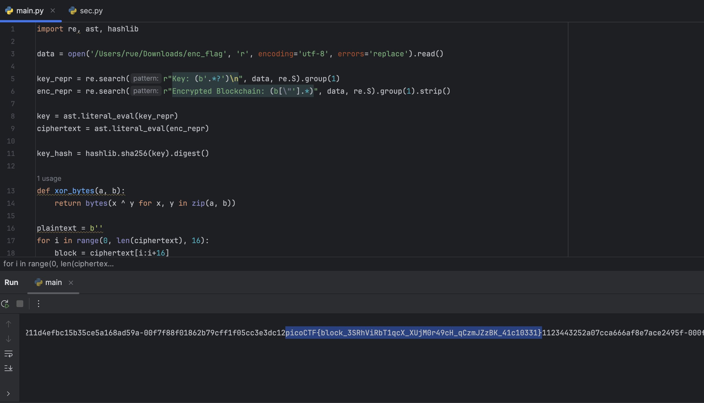

# Tap into Hash — Reverse Engineering

**Platform:** picoCTF 2025  
**Category:** Reverse Engineering / Crypto  
**Difficulty:** Medium  
**Flag:** `picoCTF{block_3SRhViRbT1qcX_XUjM0r49cH_qCzmJZzBK_41c10331}`

---

## TL;DR

The challenge ships a toy "blockchain encryptor" (`block_chain.py`) and an `enc_flag` file. Reading `enc_flag` reveals it is not raw binary ciphertext but a captured console log that includes a debug `print()` of the secret key right alongside the encrypted output. Recovering the key, reproducing the repeating-key XOR scheme from source, and decrypting yields the flag spliced into the middle of the blockchain string.

---

## Files provided

| File | Description |
|------|-------------|
| `block_chain.py` | Source that generated the encrypted file |
| `enc_flag` | The "encrypted" flag output |

---

## Step 1 — Read the challenge description



The prompt says: *"Can you make sense of this source code file and write a function that will decode the given encrypted file content?"*

Hints confirm the blockchain theme and direct us to reverse-engineer the source. The key question is: what does `enc_flag` actually contain?

---

## Step 2 — Inspect `enc_flag` before writing any crypto code

```bash
head -c 300 enc_flag
```



```
Key: b'\x8e\xdc\x08\xb8S\xee6\x0c\xf5\xfd\xceP\x15\xbf\xf6\xe2...'
Encrypted Blockchain: b"\xb4\xc8\xbd\xec@A\xbd-\x1d\xfd\x16\xe1...
```

It is **plain text** — not binary ciphertext. It is the captured stdout of `main()`, which called:

```python
print("Key:", key)
print("Encrypted Blockchain:", encrypted_blockchain)
```

The secret key was never actually secret: it was printed to the console and saved verbatim into the output file. This is the entire vulnerability — no cryptanalysis needed.

---

## Step 3 — Understand the encryption scheme

Reading `block_chain.py`:

```python
def encrypt(plaintext, inner_txt, key):
    midpoint = len(plaintext) // 2
    modified_plaintext = plaintext[:midpoint] + inner_txt + plaintext[midpoint:]
    plaintext = pad(modified_plaintext, 16)
    key_hash = hashlib.sha256(key).digest()   # 32-byte digest

    ciphertext = b''
    for i in range(0, len(plaintext), 16):
        block = plaintext[i:i + 16]
        ciphertext += xor_bytes(block, key_hash)  # zip truncates to 16 bytes
    return ciphertext
```



Key observations:

| Property | Detail |
|----------|--------|
| Flag placement | Spliced into the **middle** of the 5-block blockchain hash string |
| Key derivation | `SHA-256(key)` → 32-byte digest; only first 16 bytes are used (due to `zip` truncation) |
| Cipher mode | Same 16-byte keystream XORed into **every** 16-byte block — classic repeating-key XOR |

Since XOR is self-inverse and the keystream is fixed, decryption is identical to encryption.

---

## Step 4 — Extract key and ciphertext, then decrypt

Both values in `enc_flag` are Python `bytes` reprs — parseable with `ast.literal_eval`:

```python
import re, ast, hashlib

data = open('enc_flag', 'r', encoding='utf-8', errors='replace').read()

key_repr = re.search(r"Key: (b'.*?')\n", data, re.S).group(1)
enc_repr = re.search(r"Encrypted Blockchain: (b[\"'].*)", data, re.S).group(1).strip()

key        = ast.literal_eval(key_repr)
ciphertext = ast.literal_eval(enc_repr)

key_hash = hashlib.sha256(key).digest()

def xor_bytes(a, b):
    return bytes(x ^ y for x, y in zip(a, b))

plaintext = b''
for i in range(0, len(ciphertext), 16):
    plaintext += xor_bytes(ciphertext[i:i+16], key_hash)

print(plaintext)
```



---

## Step 5 — Flag

```
...00f7f88f01862b79cff1f05cc3e3dc12
picoCTF{block_3SRhViRbT1qcX_XUjM0r49cH_qCzmJZzBK_41c10331}
1123443252a07cca666af8e7ace2495f...
```

The flag sits exactly where `encrypt()` placed it — spliced into the middle of the third blockchain hash.

---

## Root Cause

| Issue | Detail |
|-------|--------|
| Secret key printed to stdout | `print("Key:", key)` was left in production output — trivial key disclosure |
| Repeating-key XOR with no IV | Same 16-byte keystream reused for every block — not a real cipher |
| `zip` truncation silently reduces key to 16 bytes | SHA-256 produces 32 bytes; only the first 16 are ever applied |
| Predictable plaintext structure | Even without the leaked key, the hex + `-` separators provide extensive known plaintext for crib-dragging |

---

## Remediation

1. **Never log or print secret material.** Debug `print` statements around keys, tokens, or secrets must be removed before any artifact is shared or deployed.
2. **Do not use hand-rolled XOR as encryption.** Use an established authenticated scheme: AES-GCM or ChaCha20-Poly1305. Both provide confidentiality and integrity.
3. **Never reuse a keystream across multiple blocks.** A stream cipher (XOR-based or otherwise) requires a fresh nonce/IV per encryption to prevent keystream reuse attacks.
4. **Understand what `zip` does to mismatched lengths.** The silent truncation of a 32-byte SHA-256 digest to 16 bytes is a subtle bug that would halve the effective key size even in a stronger scheme.
