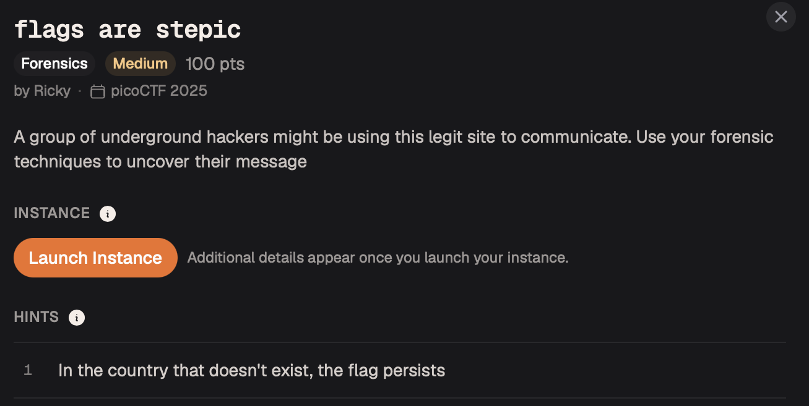

# flags are stepic — Steganography

**Platform:** picoCTF 2025  
**Category:** Steganography  
**Difficulty:** Easy  
**Flag:** `picoCTF{...}`

---

## TL;DR

A PNG image carries a hidden text message embedded by the [`stepic`](https://github.com/yVRn9oPO2yWI/stepic) Python library, which performs standard LSB steganography on the RGB channels. Decoding it with `stepic.decode()` directly returns the flag.

---

## Background: stepic

`stepic` is a Python library (and CLI tool) for steganography in images. Its default mode encodes a message by replacing the LSB of each red, green, and blue channel value with successive bits of the payload, working left-to-right, top-to-bottom across the image. The message is prefixed by a 4-byte length field so `decode()` knows how many bytes to extract.

Because `stepic`-encoded images look visually identical to their originals, the only reliable detection method is attempting to decode them — or noticing LSB variance patterns with bit-plane analysis tools (Stegsolve, CyberChef "Extract LSB").

---

## Step 1 — Identify the stego tool

The challenge name, **"flags are stepic"**, is a direct hint — `stepic` is the library used. In real-world scenarios, tool identification can come from:
- Challenge title / description
- Known CTF patterns
- Comparing LSB extraction output against `stepic`'s framing format (4-byte length prefix)

---

## Step 2 — Decode with Python

```python
import stepic
from PIL import Image

Image.MAX_IMAGE_PIXELS = None        # suppress DecompressionBomb warning for large files

img = Image.open('upz.png')
data = stepic.decode(img)
print(data)
```

`stepic.decode()` reads the 4-byte length header, extracts that many bits from the RGB LSBs in raster order, and returns the hidden payload as a string.



---

## Installation

```bash
pip install stepic Pillow
```

---

## Alternative: CyberChef

1. Drop `upz.png` into CyberChef's Input pane.
2. Add **Extract LSB** → channels: Red, Green, Blue.
3. Look for a printable ASCII string in the output.
   - `stepic` encodes the length as the first 4 bytes (big-endian int); the payload follows immediately.
   - The flag starts after those 4 bytes.

---

## Key Takeaways

- `stepic` is a standard CTF tool; recognising it by name or by its framing format saves significant time.
- `Image.MAX_IMAGE_PIXELS = None` is needed when working with large PNGs to suppress Pillow's decompression-bomb safety check.
- When a challenge title or file name contains the word "stepic", try `stepic.decode()` immediately before reaching for more generic bit-plane analysis.
