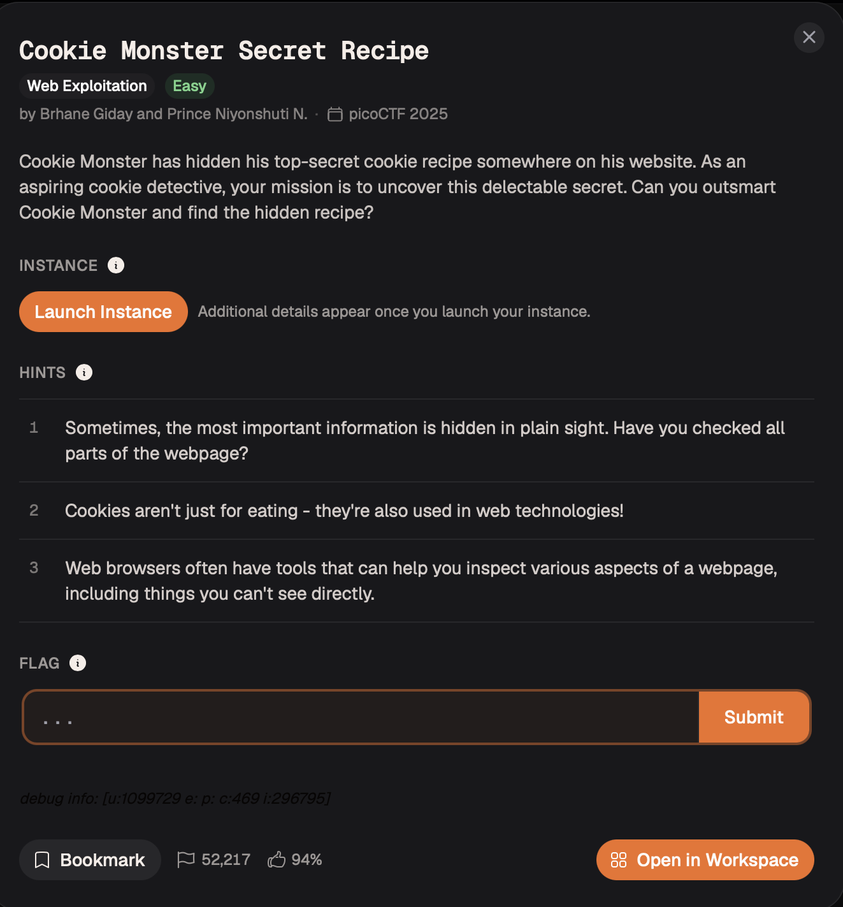
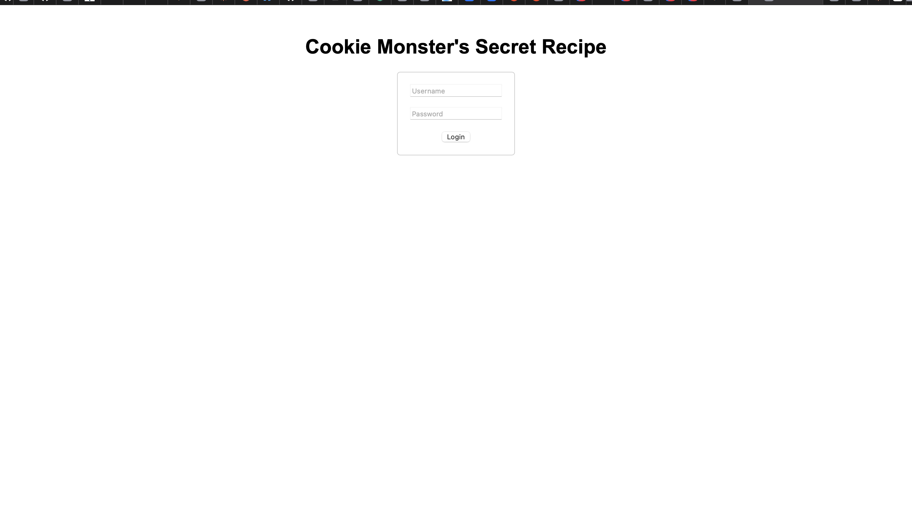
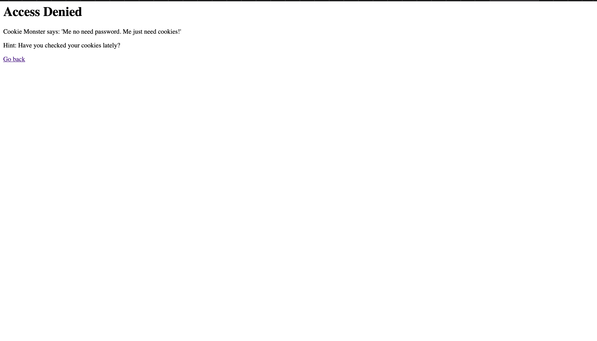

# Cookie Monster's Secret Recipe — Web Exploitation

**Platform:** picoCTF 2025  
**Category:** Web Exploitation  
**Difficulty:** Easy  
**Flag:** `picoCTF{c00k1e_m0nster_l0ves_c00kies_B3AD94C2}`

---

## TL;DR

The login page rejects every credential but helpfully hints to "check your cookies." The server sets a cookie named `secret_recipe` whose value is the flag encoded in Base64. No authentication bypass is needed — the secret is sitting in the browser's cookie jar, one decode away.

---

## Recon

The target (`http://verbal-sleep.picoctf.net:54468/`) shows a standard login form. Submitting any username/password returns:

```
Access Denied
Cookie Monster says: 'Me no need password. Me just need cookies!'
Hint: Have you checked your cookies lately?
```



The error message is an explicit pointer to the browser's cookie storage rather than the authentication logic.

---

## Step 1 — Inspect the cookie jar

Open DevTools (`F12`) → **Application** tab → **Cookies** → select the site origin.

A cookie is already set by the server:

| Name | Value |
|------|-------|
| `secret_recipe` | `cGljb0NURntjMDBrMWVfbTBuc3Rlcl9sMHZlc19jMDBraWVzX0IzQUQ5NEMyfQ%3D%3D` |



The `%3D%3D` suffix is URL-encoded `==` — the standard Base64 padding sentinel. The value is Base64-encoded.

---

## Step 2 — Decode

URL-decode first, then Base64-decode (CyberChef, Python, or any online tool):

```
cGljb0NURntjMDBrMWVfbTBuc3Rlcl9sMHZlc19jMDBraWVzX0IzQUQ5NEMyfQ==
```

```
picoCTF{c00k1e_m0nster_l0ves_c00kies_B3AD94C2}
```



---

## Root Cause

The server stores the flag as a client-readable cookie value before the user has authenticated at all. Base64 is an **encoding**, not an **encryption** — it provides zero confidentiality and is trivially reversible by anyone who can read the cookie.

---

## Remediation

1. **Never store secrets or sensitive data in client-readable cookies.** A session cookie should carry an opaque, randomly generated session ID that maps to server-side state — not the data itself.
2. **If cookie data must carry state**, sign it with an HMAC (e.g. `itsdangerous` in Python, `Flask-Session`) so the server can detect tampering, and encrypt it if the content must remain confidential.
3. **Apply `HttpOnly` and `Secure` flags** on all sensitive cookies — `HttpOnly` prevents JavaScript access, `Secure` restricts transmission to HTTPS. Neither flag fixes this challenge's core issue (the data should not be there at all), but both are required baseline hardening.
4. **Do not leak secrets before authentication.** The flag cookie was set on the initial page load, before any credential check could occur.
